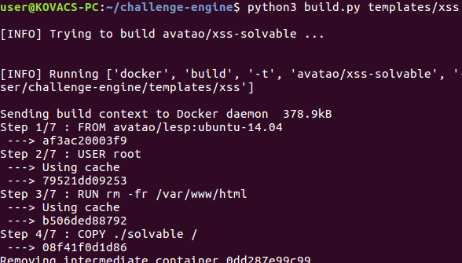
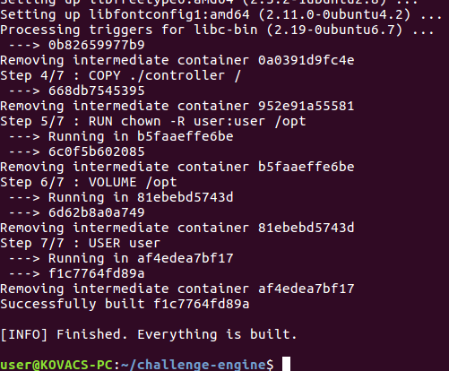
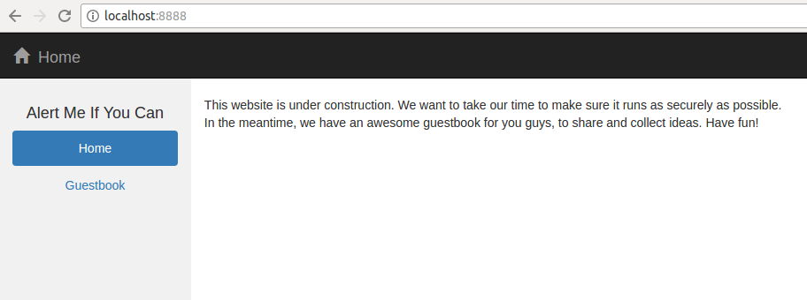
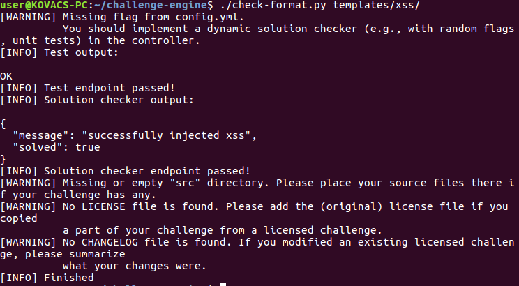

# challenge-toolbox

The challenge toolbox is a small component which allows you to create, run and check new avatao challenges locally. If you have any questions don't hesitate to contact us at [content@avatao.com](mailto:content@avatao.com).  

## Rules of participation

[Avatao](https://avatao.com) is a company that wants to make hands-on training accessible to everyone. This includes open-source communities and other businesses also. 

- **Ownership of challenges**: We released this tool to help people to run their own exercises locally and share with others. 
- **Open-source licensing**: The value to the community contribution is huge - each one is given in service and respect to the community. To respect this, we release the challenge toolbox and the related templates under *Apache 2.0* License. We do not restrict the use of derived challenges as long as they are contributed back under the same license. 
- **Business services**: Avatao provides a 24/7 runtime environment that allows you to expose your challenge online in an easy way. Note that Avatao provides additional services (e.g., custom-tailored challenges for businesses, community organizations, enterprise support, training programs, customized learning) as part of a business offering.


## Create your own challenge

### Prerequisites

* Docker
* Python 3
* Run `pip3 install -r requirements.txt`


### Quick Reference

* Choose a challenge template from the `templates` directory
* Build challenge: `./build.py <challenge_folder>` (e.g., `python3 ./build.py templates/xss`)
* Start challenge: `./start.py <challenge_folder>` (e.g., `python3 ./start.py templates/xss`)
* Check challenge format: `./check-format.py <challenge_folder>` (e.g., `python3 ./check-format.py templates/xss`)
* Check challenge solution `./check-solution.py <optional_flag>` (e.g., `python3 ./check-solution`)
* Create tests to check the correct solution
* Cleanup: `./docker-cleanup.sh`


### **Start with a challenge template**

So as to ease challenge development we've prepared templates for different challenge types using our [base images](https://hub.docker.com/u/avatao/) (e.g., ubuntu, controller, exploitation, web-ide). These templates contain examples for static and container-based challenges. Please use the one which fit your needs and customize it as you like.

- [Static challenges without containers](templates/file)
- [Challenges running a server and accept client connections via telnet](templates/telnet)  
- [Challenges accepting connections via SSH](templates/ssh)  
- [C programming challenges](templates/c)  
- [C# programming challenges](templates/csharp)  
- [Java programming challenges](templates/java)  
- [XSS challenges](templates/xss)  

By cloning this repository you get **scripts** and **skeleton** files that will help you a lot in challenge creation.

### **Build**

To build your challenge images (e.g., solvable, controller) please use our 
build script as follows.

    ./build.py <repository_path>





For example, if your repository path is `/home/user/my-challenge`, your images will be called
`my-challenge-solvable` and `my-challenge-controller`, if you have `Dockerfile` for both controller and solvable.

If you do not want to build both images, just simply modify the name of image (e.g., `solvable_`) you do not need now and the script skips it.

Only the first build is slow. If you modify any file in those directories, you need to run a rebuild before starting them. 

If the build process was successful you should see your new docker image by typing the following command:

    docker images
    

### **Start**  

To start your challenge, simply type: 

    ./start.py <repository_path>   


When a controller-solvable pair is started, you can address them internally as `localhost`, thus no IP address is required. This is useful, for example, when you want to access the solvable with a solution checking script from the controller container. See the [example](templates/xss/controller/opt/solution.js) for more details.




### **Modify and check format**

In the next step, please modify the cloned template in accordance with 
your challenge. If you have prepared everything, run our checker script of this guide repository by simply
typing.

    ./check-fomat.py <repository_path>
    
For example, if your challenge is located at path `/home/user/my-challenge`, your command is the following.

    ./check-format.py /home/user/my-challenge




Note that `check-format.py` will fail until you start your challenge, however, it is good to verify if everything is in place.
Please fine-tune your files until you see errors. This script will help you a lot:

1. Checks if your files are in place
2. Checks if your configuration (config.yml) and markdown files (e.g., writeup.md) are correct
3. Invokes solution check and the **test** function automatically for docker-based challenges to check if your challenge is working well. 


### **Manual solution checking**  

Avatao platform calls into the controller via HTTP with the (optional) flag that user submitted. You will be able test that functionality locally with following command:  

    ./check-solution.py <optional_flag>
 


### **Manual challenge testing**  

Before every challenge deployment on avatao, we automatically test if the challenge is working properly. To do that, you need to implement the `test` function in the controller's `server.py`. You can find [here](templates/c/controller/opt/server.py) an example `test` function implementation for C programming challenges. 

After implementing the `test` function you can simply run `curl` to make sure that everything works well.  

    curl 127.0.0.1:5555/secret/test

Similarly to solution checking, the `test` function returns with HTTP 200 status code if all the tests passed and
returns with the build log. Otherwise the HTTP status code is 500.


### **Clean**

Sometimes it is worth removing stalled and dangling images. To do that simply
run our clean-up script:

    ./docker-cleanup.sh


## Best practices
 
We have prepared many useful packages and dependencies in our base images and templates, but you might need to get your hands dirty and add extra stuff. To help you, we summarized the most important best practices you should know about docker.

### Docker commands and options

- If you need to install extra packages to controller use the following template:
    
        FROM avatao/controller:ubuntu-14.04
        
        USER root
        RUN apt-get -qy update \ 
            && apt-get install -qy <your_package>
        USER user
        
        COPY ./controller/ /


- The `USER user` docker command should be used in the solvable `Dockerfile` if a service can run without root privileges.
- Please, make sure that none of the user-controllable services run with root privileges. For example, an SSH daemon can run as root but it should only allow non-privileged users to log in.
- The `COPY` docker command is the preferred way to add your files directories to a container. It has various advantages over `ADD`: 1) simple, 2) preserves file attributes, 3) do not decompress archives or fetch URLs.
- Minimize filesystem layers by reducing the number of `RUN` commands.
- If you do not delete something in the same `RUN` command it was created in, it will still be part of the final image in an internal layer.
- The `find /bin /sbin /usr -perm /6000 -exec chmod -s '{}' \;` command disables suid flags on system files so we could safely keep the `SETGID` and `SETUID` capabilities for a challenge.

There are various runtime docker options that we plan to turn on when starting your challenge with the `docker run` command. 

- The `--read-only` option mounts the container's root filesystem as read only. As certain challenges require to have writable directories and files, you can add volumes with the `VOLUME` docker command. For example we added the following volumes for LAMP base images by default.
    ```
    VOLUME ["/etc/mysql", "/var/lib/mysql", "/etc/php5/apache2", "/var/log", "/run"]
    ```
- By default we drop all the capabilities with `--cap-drop=ALL` as you can see in `start.py`. To add extra capabilities please use the capabilities field of `config.py`. If you do not need extra capability just simply leave the array empty (['']). 
 
_Reference_:  

* https://docs.docker.com/engine/reference/builder/
* https://docs.docker.com/engine/reference/commandline/run/
* https://docs.docker.com/engine/reference/run/#runtime-privilege-and-linux-capabilities
* https://docs.docker.com/engine/userguide/eng-image/dockerfile_best-practices/

### **Challenge debugging**

It might take too much time to keep waiting for `build.py` and `start.py` to finish when you want to debug your challenge. 
It is much simpler to start your challenges with `start.py` and the run 

    docker exec -ti <name> bash


    
For example, if you have problems with implementing the test endpoint in the controller, it is better if you simply
copy `server.py` at a writeable path (e.g., added with the `VOLUME` command) and edit locally with `vim` for example.
**IMPORTANT** Don't forget to save your changes outside the container regularly, as all your modifications will be lost
if you stop `start.py`.


### **Random flag generation**  

In order to avoid trivial user cheats flags can be dynamically generated every time a challenge is started. Here are two options:
- **flag = static part + random part**: In this case, a fix static part is extended with a suffix randomly generated whenever the challenge is started. 
 
- **totally random flag**: In the code below, we store an entirely random flag in the solvable's `/var/flag/flag.txt` file. This file is also accessible for the controller container. 
    
    controller/opt/server.py
    ```
    #random flag generation
    with open("/home/user/flag.txt","w") as f:
        f.write("Ea5Y_Pea5Y_")
        for x in random.sample(range(1, 5000), 8):
            f.write(str(x))
            if x%2 == 0:
                f.write("_/")

    # solution checking
    def solution_check():
        submitted_solution = request.json['solution']
        if submitted_solution != open('/var/flag/flag.txt').read():
            return jsonify(solved=False)
        return jsonify(solved=True)
    ```

### **Writeup guide**

1. Every challenge should have an own separate `writeup.md` file under the `metadata` directory.
2. Add the challenge name in H1 style as the example [writeup.md](skeleton/metadata/writeup.md) shows it.
3. The writeup should have at least 3 sections.
4. The cost of first section should be 0%, because it's just a detailed "What to do here?".
5. Each section describes a relevant part from the complete solution. Thus, users should be able to solve the challenge by simply following the instructions of each section. 
6. Every section begins with "## " which is an atx-style header (H2) and continues with a name which summarizes well the contents of the section (e.g., contains specific keywords). Take care of inserting a space after "##" to be compatible with the markdown standard.
7. When a user requests hints we first show him the section names mentioned above with the cost of **10%** of the challenge score. We suppose that the name of sections helps users enough to continue the challenge or at least they can choose which section to open. In this way, we only deduct the cost of requested sections and this additional **10%** from the challenge score. 
8. Under each section the "Cost: x%" tag shows the percentage that we deduct from the challenge score if a user asks for this part of the solution. The sum of costs of all but the last sections should be equal to **90%**! 
9. The last section should be called `Complete solution` which does not have a cost as it is only revealed when somebody asks for the complete solution. In that case we show him the entire writeup.
*IMPORTANT* We highly recommend to insert a few lines of notes about mitigations (e.g., how to fix the vulnerability) if the challenge is an offensive one.  

## Documentation

[Please read the docs for more information](docs/README.md).

## Troubleshooting  

### *I'm getting port already taken errors when starting a solvable-controller pair*  
Please don't try to run more than one solvable-controller pairs.  
If it is not the case, something else went wrong and kill all docker containers using:  

    docker kill $(docker ps -q)

If you get docker usage message upon killing, then there were no running containers.  

### *Solvable starts, but connection attempts fail with:*  

    ssh_exchange_identification: Connection closed by remote host

You run a command in solvable which blocks the start of SSH daemon. Fix the problematic command, and rebuild. This weird behavior is observed because docker accepts connection attempts to published ports but then resets them if the published port isn't really listening.  

### *I need to enter the container for error checking:*
Just build the container with `build.py`, check the built image with `docker image` and :  

    docker run -ti <repository|ID> bash

The container will get removed, when you exit it.  

### *I need to enter a running container as root to figure something out*  

If sshd's non-root login is not enough for you. You can still use `docker exec`. To use `docker exec`, find first the hash of your running container using  

    docker ps  
    
After that simple execute the following command  

    docker exec -ti <name|ID> bash


## **Questions**  

content@avatao.com  
